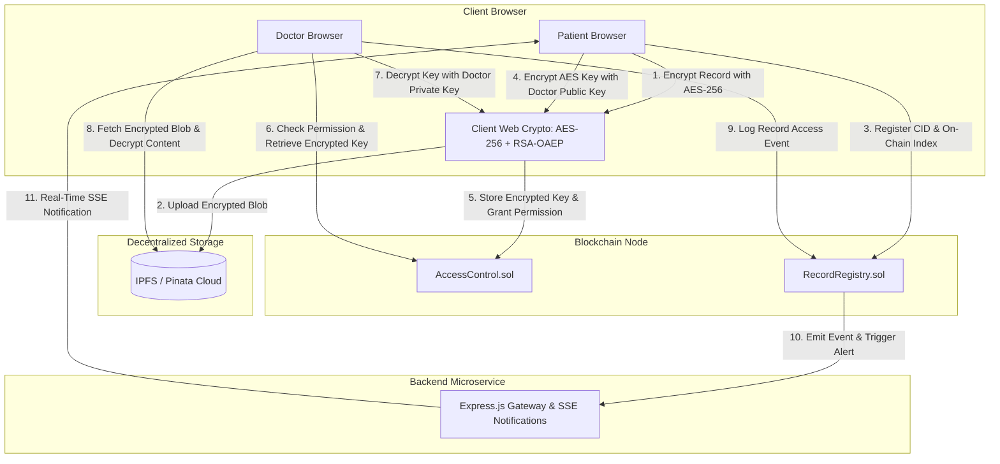

# 🏥 MediChain: Decentralized Healthcare & Consent Management System

[](https://soliditylang.org/)
[](https://ethereum.org/)
[](https://hardhat.org/)
[](https://react.dev/)
[](https://vitejs.dev/)
[](https://ipfs.tech/)
[](https://opensource.org/licenses/MIT)

MediChain is an enterprise-grade, decentralized Electronic Health Record (EHR) and Patient Consent Management platform. It empowers patients with sovereign ownership over their personal medical records using **Ethereum Smart Contracts**, **InterPlanetary File System (IPFS)**, and **Client-Side End-to-End Cryptography (AES-GCM + RSA-OAEP)**.

---

## 📑 Table of Contents

- [Key Features](#-key-features)
- [System Architecture](#-system-architecture)
- [Cryptographic Security Model](#-cryptographic-security-model)
- [Smart Contracts Overview](#-smart-contracts-overview)
- [Tech Stack](#-tech-stack)
- [Project Structure](#-project-structure)
- [Getting Started](#-getting-started)
  - [Prerequisites](#prerequisites)
  - [1. Installation](#1-installation)
  - [2. Environment Configuration](#2-environment-configuration)
  - [3. Start Local Blockchain (Hardhat)](#3-start-local-blockchain-hardhat)
  - [4. Deploy Smart Contracts](#4-deploy-smart-contracts)
  - [5. Launch Backend Server](#5-launch-backend-server)
  - [6. Launch Frontend Client](#6-launch-frontend-client)
  - [7. MetaMask Setup](#7-metamask-setup)
- [Application Pages & Modules](#-application-pages--modules)
- [Backend REST & SSE Endpoints](#-backend-rest--sse-endpoints)
- [Testing](#-testing)
- [License](#-license)

---

## 🌟 Key Features

- **🔐 Zero-Knowledge Medical Privacy (Client-Side Encryption):**
  Medical files and metadata are encrypted client-side in the browser using **AES-256-GCM** before leaving the patient's device. No unencrypted protected health information (PHI) ever touches servers or the blockchain.
- **🤝 Cryptographic Key Sharing (RSA-OAEP):**
  When granting access to a healthcare provider, the record's symmetric AES key is encrypted using the doctor's registered RSA-OAEP public key and securely dispatched on-chain.
- **📜 Sovereign Consent Management:**
  Patients can grant, modify, or revoke granular access permissions per-doctor or per-record at any time. Revoking consent instantly invalidates key exchange references.
- **🌐 Decentralized Storage via IPFS:**
  Encrypted payloads are pinned to IPFS (via Pinata Gateway with local mock fallback), guaranteeing high availability, tamper resistance, and content-addressed persistence.
- **🔍 Tamper-Proof On-Chain Audit Ledger:**
  Every record registration, consent grant, revocation, and record viewing event is immutably recorded on the blockchain, providing full regulatory compliance (HIPAA / GDPR auditability).
- **⚡ Real-Time Notification Stream:**
  Integrated Server-Sent Events (SSE) alert patients instantly whenever a doctor views or requests access to their health records.
- **🛡️ Hybrid Fallback Mode:**
  Gracefully operates with live MetaMask and Hardhat/Sepolia nodes, while offering transparent mock-data simulation when running in offline testing environments.

---

## 🏗️ System Architecture



---

## 🔒 Cryptographic Security Model

1. **Patient Registration:**
   - The user generates an **RSA-OAEP 2048-bit** key pair in the browser.
   - The public key is stored on-chain via `AccessControl.registerPublicKey()`.
   - The private key is securely cached in local session storage and never exposed.
2. **Record Upload:**
   - A unique **AES-GCM 256-bit** key is generated per document.
   - The health record file/data is encrypted client-side.
   - The AES key is wrapped with the patient's own public key (`encryptedOwnerKey`).
   - The encrypted payload is uploaded to IPFS, returning a Content Identifier (CID).
   - Record metadata and CID are saved on `RecordRegistry.sol`.
3. **Doctor Key Exchange:**
   - The patient retrieves the doctor's public key from `AccessControl.sol`.
   - The patient unwraps the record AES key with their private key, re-encrypts it using the doctor's public key, and invokes `grantAccess()`.
   - Only the designated doctor holding the corresponding private key can decrypt the AES key to view the medical file.

---

## 📜 Smart Contracts Overview

The contracts are built in Solidity (`^0.8.20`) and managed using Hardhat:

### 1. `AccessControl.sol`
- **`registerPublicKey(string pubKey)`**: Registers an RSA-OAEP public key for the caller.
- **`getPublicKey(address user)`**: Retrieves the public key of any participant.
- **`grantAccess(address doctor, string recordId, string encryptedKey)`**: Grants access to a record and stores the doctor-specific encrypted AES key.
- **`revokeAccess(address doctor, string recordId)`**: Revokes doctor permission for a specific record.
- **`grantGlobalAccess(address doctor)` / `revokeGlobalAccess(address doctor)`**: Toggles global emergency or full-portfolio access.
- **`hasAccess(address patient, address doctor, string recordId)`**: Verifies authorization.
- **`getEncryptedKey(address patient, address doctor, string recordId)`**: Returns the encrypted AES key if caller is authorized.

### 2. `RecordRegistry.sol`
- **`registerRecord(...)`**: Registers a record with CID, title, category, facility, and patient's encrypted key.
- **`getRecord(string recordId)`**: Fetches record metadata and verifies access control via `AccessControl.sol`.
- **`getPatientRecords(address patient)`**: Lists all record IDs owned by a patient.
- **`logRecordView(string recordId)`**: Emits `RecordViewed` event on-chain for auditing access events.

---

## 💻 Tech Stack

| Domain | Technologies |
|---|---|
| **Smart Contracts** | Solidity 0.8.20, Hardhat, Ethers.js v6, Hardhat Toolbox |
| **Frontend** | React 19, Vite 8, React Router v7, Lucide Icons, Vanilla Modern CSS |
| **Cryptography** | Web Crypto API (SubtleCrypto: AES-256-GCM, RSA-OAEP) |
| **Storage** | IPFS (InterPlanetary File System), Pinata Cloud API |
| **Backend** | Node.js, Express.js, Axios, Server-Sent Events (SSE), Cors, Dotenv |
| **Wallet / Web3** | MetaMask, Eip1193 Provider, JSON-RPC (Hardhat Localhost / Sepolia) |

---

## 📁 Project Structure

```text
Healthcare-Blockchain/
├── contracts/                  # Solidity smart contracts
│   ├── AccessControl.sol       # Permission & cryptographic key exchange
│   └── RecordRegistry.sol      # EHR indexing & audit trail
├── scripts/
│   └── deploy.cjs              # Automated deployment & addresses exporter
├── backend/                    # Express microservice & IPFS gateway
│   ├── server.js               # REST API & SSE notification server
│   ├── package.json            # Backend dependencies
│   └── addresses.json          # Synced contract deployment ABI & addresses
├── src/                        # React Frontend application
│   ├── components/             # Reusable UI components
│   │   ├── Navbar.jsx          # Header navigation & wallet indicator
│   │   └── Visualizer.jsx      # Interactive cryptographic state visualizer
│   ├── contracts/              # Frontend synced ABIs & addresses
│   │   └── addresses.json
│   ├── pages/                  # Application views
│   │   ├── Home.jsx            # Landing page & system architecture overview
│   │   ├── Dashboard.jsx       # Patient dashboard & health metric cards
│   │   ├── ProviderPortal.jsx  # Doctor portal & record access interface
│   │   ├── Records.jsx         # Medical file encryption & IPFS uploader
│   │   ├── Consent.jsx         # Granular consent management & permissions
│   │   └── AuditLedger.jsx     # Live immutable blockchain audit trail
│   ├── services/               # Utility services
│   │   ├── blockchain.js       # Ethers.js contract connector & wallet helper
│   │   ├── crypto.js           # Client-side AES-GCM & RSA-OAEP cryptography
│   │   ├── ipfs.js             # IPFS upload & content resolution
│   │   └── storage.js          # Unified local & contract state store
│   ├── App.jsx                 # Route configurations
│   ├── index.css               # Modern design system & animations
│   └── main.jsx                # Application root entry point
├── hardhat.config.cjs          # Hardhat configuration (Chain ID: 1337)
├── package.json                # Frontend & Hardhat configuration
├── vite.config.js              # Vite bundling config
└── README.md                   # Project documentation
```

---

## 🚀 Getting Started

### Prerequisites

Ensure you have the following installed on your machine:
- **Node.js** (v18.x or v20.x recommended)
- **npm** or **yarn**
- **Git**
- **MetaMask browser extension**

---

### 1. Installation

Clone the repository and install dependencies for both the main app and backend:

```bash
# Clone the repository
git clone https://github.com/jhansi131619-bit/Healthcare-Blockchain.git
cd Healthcare-Blockchain

# Install root dependencies (React, Vite, Hardhat, Ethers)
npm install

# Install backend dependencies
cd backend
npm install
cd ..
```

---

### 2. Environment Configuration

Create a `.env` file in the root directory (optional for local development, required for Sepolia or Pinata):

```env
# Hardhat / Ethereum Config
PRIVATE_KEY=0xac0974bec39a17e36ba4a6b4d238ff944bacb478cbed5efcae784d7bf4f2ff80
SEPOLIA_RPC_URL=https://sepolia.infura.io/v3/YOUR_INFURA_PROJECT_ID

# IPFS Pinata (Optional - fallback to local mock storage if empty)
PINATA_API_KEY=your_pinata_api_key
PINATA_SECRET_API_KEY=your_pinata_secret_api_key
PINATA_JWT=your_pinata_jwt_token
```

Create `.env` in the `backend/` folder:
```env
PORT=3001
PINATA_JWT=your_pinata_jwt_token
```

---

### 3. Start Local Blockchain (Hardhat)

Launch the local Ethereum node (pre-configured with Chain ID `1337` to match MetaMask's built-in Localhost network):

```bash
npx hardhat node
```

> **Note:** Keep this terminal window open. It will print 20 test accounts with 10,000 test ETH each.

---

### 4. Deploy Smart Contracts

In a new terminal window, compile and deploy the contracts to the local node:

```bash
npx hardhat run scripts/deploy.cjs --network localhost
```

This will automatically:
1. Deploy `AccessControl.sol`
2. Deploy `RecordRegistry.sol`
3. Export contract addresses and ABIs directly to:
   - `src/contracts/addresses.json` (for React UI)
   - `backend/addresses.json` (for Backend APIs)

---

### 5. Launch Backend Server

Start the Node/Express backend on port `3001`:

```bash
cd backend
npm start
```

---

### 6. Launch Frontend Client

In another terminal, start the Vite development server:

```bash
npm run dev
```

Open **http://localhost:5173** in your browser.

---

### 7. MetaMask Setup

1. Open your **MetaMask** extension.
2. Switch network to **"Localhost 8545"** (Default Chain ID `1337`, RPC: `http://127.0.0.1:8545`).
3. Import a pre-funded Hardhat test account:
   - Click account icon → **Add account or hardware wallet** → **Import account**.
   - Paste Account #0 private key:
     ```text
     0xac0974bec39a17e36ba4a6b4d238ff944bacb478cbed5efcae784d7bf4f2ff80
     ```
4. Click **"Connect Wallet"** on the MediChain navigation bar.

---

## 🖥️ Application Pages & Modules

| Route | Page | Purpose |
|---|---|---|
| `/` | **Home** | System overview, live cryptographic visualizer, network connection status |
| `/patient` | **Patient Dashboard** | Unified view of patient records, active consents, and quick access metrics |
| `/doctor` | **Provider Portal** | Doctor interface to request access, decrypt authorized records, and examine patient files |
| `/upload` | **Upload Records** | Client-side file encryption (AES-256), IPFS upload, and smart contract minting |
| `/consent` | **Consent Manager** | Real-time granular permission toggles, doctor authorizations, and instant revocation |
| `/audit` | **Audit Ledger** | Searchable on-chain audit trail detailing all access grants, revocations, and views |

---

## 📡 Backend REST & SSE Endpoints

| Method | Endpoint | Description |
|---|---|---|
| `GET` | `/api/health` | Server status and connectivity check |
| `GET` | `/api/notifications` | Server-Sent Events (SSE) stream for real-time access alerts |
| `POST` | `/api/ipfs/upload` | Upload and pin encrypted record blob to IPFS / Pinata |
| `GET` | `/api/ipfs/:hash` | Retrieve encrypted file content by IPFS CID |
| `POST` | `/api/events/record-viewed`| Ingests viewing logs and broadcasts alerts to listening patients |

---

## 🧪 Testing

Run Hardhat automated test suites:

```bash
npx hardhat test
```

Generate test coverage reports:

```bash
npx hardhat coverage
```

---

## 📄 License

This project is licensed under the **MIT License** — see the [LICENSE](LICENSE) file for details.

---

<p align="center">
  <b>MediChain</b> — Empowering patients with sovereign, secure, and decentralized health data management.
</p>
